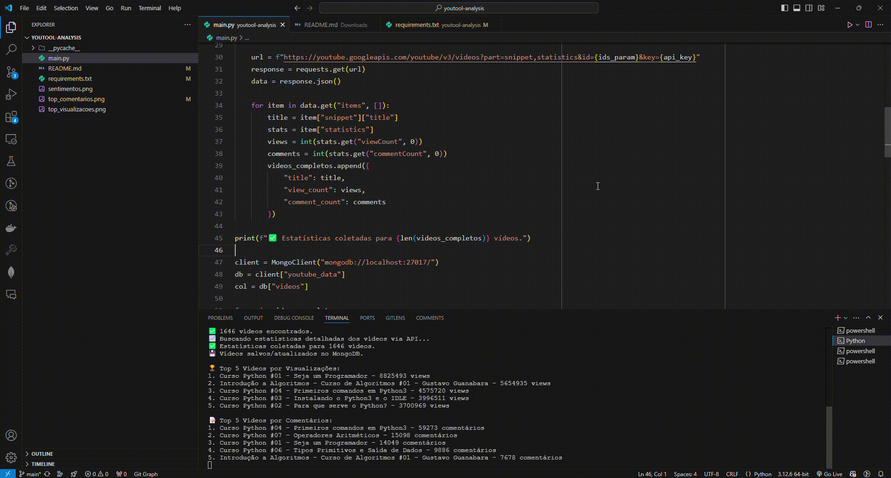

# 📊 YouTube Video Analytics com youtool + MongoDB

Este projeto coleta, armazena e visualiza estatísticas de vídeos de um canal do YouTube usando a biblioteca [`youtool`](https://pypi.org/project/youtool/), a API pública do YouTube e o MongoDB como banco de dados.

## 🔧 Funcionalidades

- Coleta automática de vídeos de um canal do YouTube (via URL)
- Consulta de estatísticas detalhadas (visualizações e comentários) via YouTube Data API
- Armazenamento e atualização dos dados no MongoDB
- Geração de gráficos dos 5 vídeos mais visualizados e mais comentados

## 🧱 Tecnologias Utilizadas

- Python 3.x
- [youtool](https://pypi.org/project/youtool/)
- requests
- matplotlib
- pymongo
- MongoDB (rodando localmente)

## 🚀 Como Executar

### 1. Clone o repositório

```bash
git clone https://github.com/seu-usuario/youtube-analytics.git
cd youtube-analytics
```

### 2. Instale as dependências

```bash
pip install -r requirements.txt
```

**`requirements.txt`:**
```txt
youtool
pymongo
matplotlib
requests
```

### 3. Configure sua API Key do YouTube

Substitua o valor da variável `api_key` no código:

```python
api_key = "SUA_CHAVE_API_AQUI"
```

Você pode obter uma chave da API em: [Google Cloud Console](https://console.cloud.google.com/)

### 4. Execute a aplicação

```bash
python main.py
```

> Certifique-se de que o MongoDB está rodando localmente em `localhost:27017`. Caso esteja usando Docker:

```bash
docker run -d -p 27017:27017 --name mongo mongo
```

## 📊 Resultados

- Gráfico `top_visualizacoes.png`: mostra os 5 vídeos mais visualizados.
- Gráfico `top_comentarios.png`: mostra os 5 vídeos com mais comentários.
- Dados dos vídeos são salvos na coleção `youtube_data.videos` no MongoDB.

## 📦 Estrutura de Dados no MongoDB

```json
{
  "title": "Título do Vídeo",
  "view_count": 123456,
  "comment_count": 789
}
```

## ✍️ Exemplo de Saída no Console

```text
🎥 Coletando lista de vídeos do canal...
✅ 200 vídeos encontrados.
📈 Buscando estatísticas detalhadas dos vídeos via API...
✅ Estatísticas coletadas para 200 vídeos.
💾 Vídeos salvos/atualizados no MongoDB.

🏆 Top 5 Vídeos por Visualizações:
1. Aula 01 - Introdução - 2,000,000 views
...

📝 Top 5 Vídeos por Comentários:
1. Aula 01 - Introdução - 10,000 comentários
...
```


